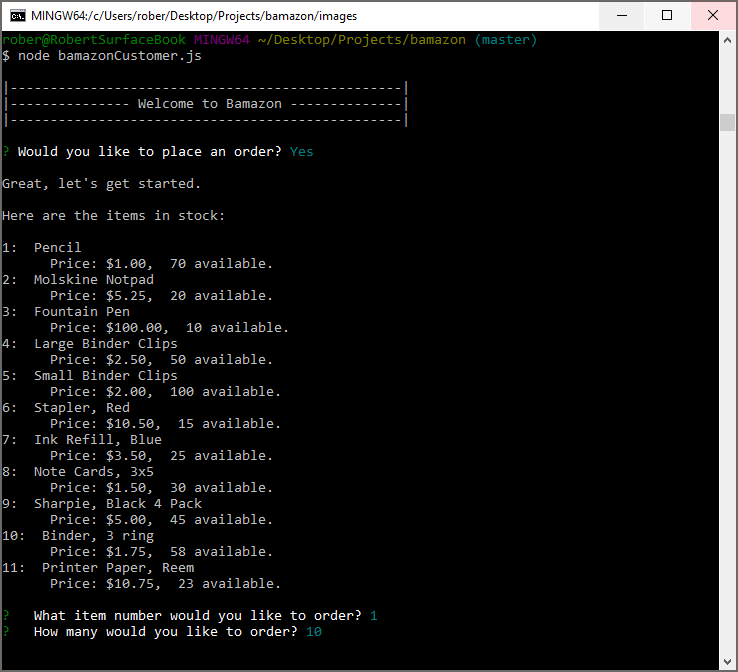
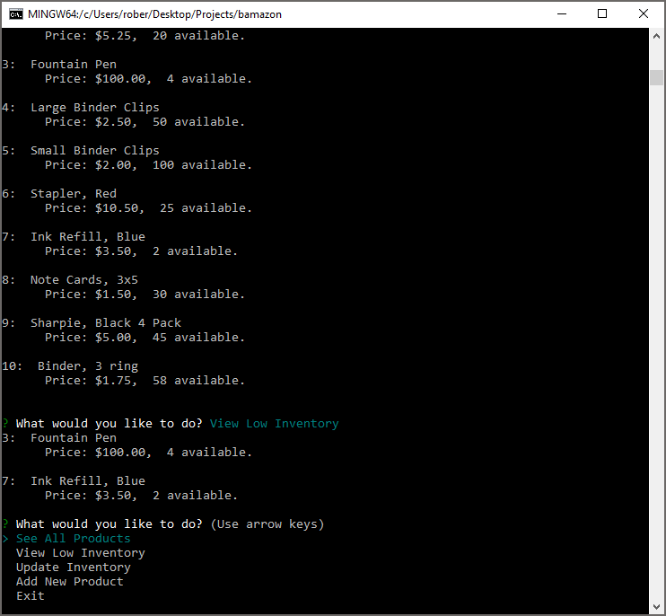

# Welcome to Bamazon

## Overview
Bamazon is a simple command-line order desk application. The current version includes two modules: Bamazon Customer is intended for use by customers to order products from available inventory and update inventory based on those orders. Bamazon Manager enables a user with manager access to view all inventory, view low inventory, update inventory (add or remove as needed) and add new products. 

Written for Node.js, Bamazon utilizes npm packages for:
* npm inquirer (prompts and user input)
* npm MYSQL (MySQL queries and functions) 

## Application Flow - Bamazon Customer

On launch, Bamazon Customer first connects to the database and then presents a simple prompt to the customer:

  **"Would you like to place an order?"**

If the answer is *no*, Bamazon Customer displays a brief message and terminates the connection to the database. 

If the customer chooses to place an order, Bamazon Customer queries the database and displays all available products. Product information includes the item number, description, price and quantity available. Bamazon Customer then asks the customer to specify which item they would like to order and the quantity.

In this example, the customer is ordering 10 units of item number 1, Pencil. There are currently 70 Pencils available and they are priced at $1.00 per unit. 

After the order is completed by the customer, Bamazon Customer confirms that the order can be fulfilled by checking that the number of units ordered is lower than the available inventory. If so, Bamazon Customer confirms the order, displays an order summary and prompts the customer with the option to place another order. In the background, Bamazon Customer has reduced the inventory by the number of units in the order and stored the new inventory count in the database.

If the customer chooses to place another order, Bamazon Customer refreshes the product list (from the database) with the current available inventory of each item. In this case, the quantity of pencils is reduced from 70 to 60 as a result of the last order of 10 pencils.

Should the customer order more of an item than is avilable in current inventory, Bamazon Customer will display a message indicating the order cannot be fulfilled and again prompts the customer with the option to place another order. 

These prompts and orders continue until the customer chooses to not place an order. At that time, a final message is displayed and the database connection is terminated. 

## Application Flow - Bamazon Manager

On launch, Bamazon Manager conntects to the database and presents four options to the user:

The first option, *See All Products*, shows all products in inventory with prices and stock level. 

In this example there are 10 items in inventory. Being a manager, this user is interested in knowing which items are running low. With *View Low Inventory*, the manager can quickly see a list of items that have fewer than 5 units in stock and that need to be replenished. 

The stock of **Fountain Pens** and **Ink Refill, Blue** are low. *Update Inventory* enables the manager to record new units added to the existing inventory. In this case, 10 new **Fountain Pens** were added to the existing inventory of 4 and 20 **Ink Refill, Blue** were added to the original 2. Now that fountain pens and ink refills are up to minimum levels, another check of low inventory shows that all items are at or above minimum stock levels.

The *Update Inventory* function can also be used to reduce stock quantities by the manager should a count show that actual inventories are lower than those reflected in the database. 

The final function of Bamazon Manager, *Add New Product*, enables a manager to add new products by specifying the name of the product, price and initial stock quantity. Each new product is added to the database and automatically given a unique product ID.

*Exit* terminates the database connection and closes the application. 
